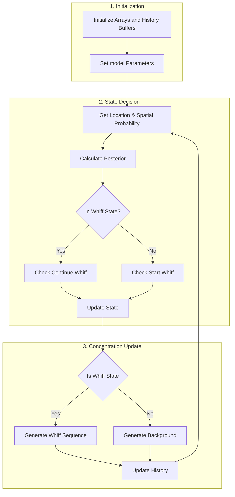

# Odor Plume Simulator
Realistic outdoor odor plume simulator 

### Algorithm

```mermaid

flowchart TD
    subgraph Initialization["1. Initialization"]
        I1[Initialize Arrays and History Buffers] --> I2[Set model Parameters]
    end

    subgraph State["2. State Decision"]
        S1[Get Location & Spatial Probability] --> S2[Calculate Posterior]
        S2 --> S3{In Whiff State?}
        S3 -->|Yes| S4[Check Continue Whiff]
        S3 -->|No| S5[Check Start Whiff]
        S4 --> S6[Update State]
        S5 --> S6
    end

    subgraph Concentration["3. Concentration Update"]
        C1{Is Whiff State}
        C1 -->|Yes| C2[Generate Whiff Sequence]
        C1 -->|No| C3[Generate Background]
        C2 --> C4[Update History]
        C3 --> C4
    end

    I2 --> S1
    S6 --> C1
    C4 --> S1

```