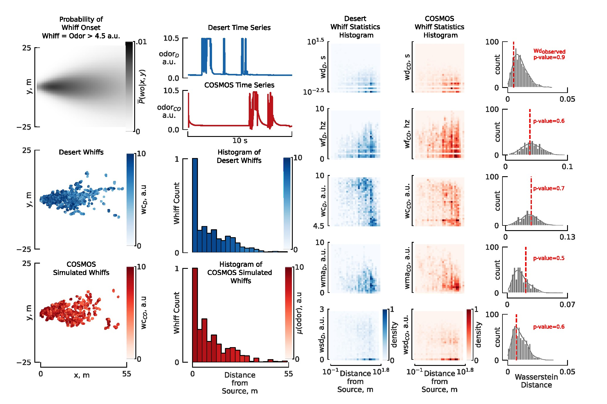

[](https://doi.org/10.5281/zenodo.15425570)

# COSMOS: A Data-Driven Probabilistic Time Series Simulator for Chemical Plumes Across Spatial Scales
The development of robust odor navigation strategies for automated environmental monitoring applications requires realistic simulations of odor time series for agents moving across large spatial scales. Traditional approaches that rely on computational fluid dynamics (CFD) methods can capture the spatiotemporal dynamics of odor plumes, but are impractical for large-scale simulations due to their computational expense. On the other hand, puff-based simulations, although computationally tractable for large scales and capable of capturing the stochastic nature of plumes, fail to reproduce naturalistic odor statistics. Here, we present COSMOS (Configurable Odor Simulation Model over Scalable Spaces), a data-driven probabilistic framework that synthesizes realistic odor time series from spatial and temporal features of real datasets. COSMOS generates similar distributions of key statistical features such as whiff frequency, duration, and concentration as observed in real data, while dramatically reducing computational overhead. By reproducing critical statistical properties across a variety of flow regimes and scales, COSMOS enables the development and evaluation of agent-based navigation strategies with naturalistic odor experiences. To demonstrate its utility, we compare odor-tracking agents exposed to CFD-generated plumes versus COSMOS simulations, showing that both their odor experiences and resulting behaviors are quite similar.

Below is a graphical representation of how the algorithm works. 


## Requirements
1. Install Packages:

   ```
   pip install pandas
   pip install h5py
   pip install numpy
   pip install matplotlib
   pip install figurefirst
   pip install tables
   pip install POT
   pip install tsfresh
   ``` 

2. To install requirements:

    ```
    pip install -r requirements.txt
    ```
3. To visualize the figures and see the results and calculations, you will need to install the following:

    * [FlyPlotLib](https://github.com/florisvb/FlyPlotLib)
    * [FigureFirst](https://github.com/FlyRanch/figurefirst)
    * [Inkscape 1.2](https://inkscape.org/release/inkscape-1.2/)

Follow the setup of [FigureFirst](https://github.com/FlyRanch/figurefirst) into inkscape.


## Files:
### Training
1. [Training COSMOS Spatial](train.ipynb) : Demonstrates how to train a cosmos spatial model
### Testing/Evaluation
2. [Testing Trajectory with COSMOS](test.ipynb) : Demonstration of how to use the spatial model and test a trajectory using the cosmos algorithm
### Agent Based Tracking
3. [Agent Based Tracking](agent_tracking.ipynb) : Surge and Cast implementation using COSMOS and CFD [Rigolli](https://elifesciences.org/articles/72196) for odor experience.
4. [Agent Tracking trajectory comparison](trajectory_comparison.ipynb) : Agent based tracking using COSMOS and CFD, trajectory comparison and timing diagram
5. [COSMOS Algorithm for testing Trajectories](cosmos_batch.py)
6. [COSMOS Algorithm for use with agent tracking](cosmos_tracking.py)
5. [Helper for CFD methods](cfd_rigolli.py)
6. [Helper for odor statistics Calculation](odor_stat_calculations.py)

### Pre-trained Models and Data and Figure svgs

All data, trained models and figures are available for download from [data dryad](http://datadryad.org/share/6ahtoddnVD7c3Tj2zKHLjVn3GTtAj-W6zqIYu9udpL4). Please place the folder `data` and `svgs` to in the home folder of COSMOS to run all scripts.

## Results

Our algorithm achieved similar outdoor statistical distribution, with a high observed wasserstein distance (higher p value representing more similarity). Below are results for desert dataset which had a windspeed ranging between 3.5m/s to 6m/s (HWS). Below is the result figure:

The result can be reproduced using this [script](figure/results_hws.ipynb).

## Figures

 Below are interactive notebooks, which can be used using Jupyter Notebook and run using python 3.8 and inskcape to generate the figures and results. These figures were generated using [figurefirst](https://github.com/FlyRanch/figurefirst) 

#### Main Text Figures: 
1. [Figure 1](figure/algorithm_figure_v3.ipynb) : Overview of COSMOS algorithm 
2. [Figure 2](figure/results_hws.ipynb) : COSMOS results on HWS desert data
3. [Figure 3](figure/results_rigolli.ipynb) : COSMOS results on Rigolli odor simulator data
4. [Figure 4](figure/results_trackingv1.ipynb) : Agent based tracking using COSMOS and CFD, trajectory comparison and timing diagram


#### Supplemental Figure

1. [Figure 5](figure/results_lws.ipynb) : COSMOS results on HWS desert data
2. [Figure 6](figure/results_forest.ipynb) : COSMOS results on HWS desert data
3. [Figure 7](figure/S1.ipynb) : Binning of whiff statistics, in depth flow diagram for concentration modeling and intermittency modeling.

